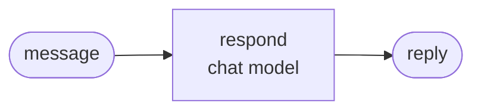

<div align="center">

# jyje/template-pilot-ai-python


<!-- pilot:tagline -->

🧪 ChatGPT サブスクリプションまたは NVIDIA NIM で動かす Python AI パイロット用 GitHub テンプレート

<!-- /pilot:tagline -->

[](https://github.com/jyje/template-pilot-ai-python)
[](LICENSE)
[](https://www.python.org)
[](docs/02-providers.md)
[](https://build.nvidia.com)

[English](README.md) / [한국어](README-ko.md) / [日本語](README-ja.md) / [简体中文](README-zh-CN.md) / [Docs](docs/README.md)

---

**お役に立てたら ⭐ をお願いします。他の方が見つける助けになります。**

</div>

<!-- template:begin -->
## このテンプレートを使う

このテンプレートからリポジトリを作り、パイロット名に変えて、レシピに沿って進めます。

```bash
gh repo create jyje/pilot-<topic> --template jyje/template-pilot-ai-python --public --clone
cd pilot-<topic>
python3 scripts/init_pilot.py pilot-<topic> --description "what it studies"
```

### 含まれるもの

- **uv アプリ**: Python 3.13、`src/` に ruff、ty、pytest を設定済みです。
- **チャットモデルのファクトリ 1 つ**とプロバイダ 2 つ: (1) Codex OAuth の ChatGPT サブスクリプション、(2) NVIDIA NIM。ケースはプロバイダに触れません。
- **サンプルのグラフ、`doctor.py`、ノートブック、オフラインテスト、CI** が最初から通ります。
- エージェント向けの**スキル**（`.agents` は `.claude` へのリンク）: `pilot-workflow`、`python-lint`、`git-commit-helper`、`centered-readme`。
- **`GOAL.md` と `PLAN.md`**: 最初のプロンプトを残し、1 項目が 1 コミットのチェックリストで計画します。
- **Mermaid 付きのドキュメント**、リリースワークフロー（タグから git-cliff で GitHub Release）、gitmoji 対応の dependabot、Copilot のセットアップ手順。

次に [GOAL.md](GOAL.md) と [PLAN.md](PLAN.md) を埋め、[レシピ](docs/03-recipe-ja.md)に沿って進めます。

<!-- template:end -->
## このパイロットの目標

*ドラフトです。このセクションをパイロットの実際の目標に置き換えてください。*

**[製品]** を **[フレームワーク]** に実際に組み込み、何ができて何ができないかを記録します。

1. **[製品] を理解する。** [1 行]。[概要](docs/01-getting-started-ja.md)を参照してください。
2. **役割分担を示す。** [1 行]。
3. **[Case 01 の目標]。** [1 行]。
4. **[Case 02 の目標]。** [1 行]。
5. **検証する。** 単体テスト、実サービスに対するスクリプト、実行済みノートブックで確認し、測定結果、失敗例、注意点を公開します。

このパイロットが目指さないもの:

- [製品] の精度を測るベンチマーク。
- 本番用コード。

## ケース

結果は `src/notebooks/` の実行済みノートブックによるもので、各実験を複数回繰り返して傾向が見えるようにしています。

### Case 01: [名前]



各メッセージをグラフに **10 回**通しました:

| メッセージ | ルート | 確信度 |
| --- | --- | --- |
| [入力 1] | `<ルート>` 10/10 | 0.99 |
| [入力 2] | `<ルート>` 10/10 | 0.85 |

表の読み方:

- **ルート**: グラフがメッセージを送った先です。`10/10` は 10 回すべてがそのルートを選んだことを表します。
- **確信度**: モデルが自分の答えをどれだけ強く選んだかを 0 から 1 で表します。迷いのなさを示すもので、正しいかどうかを示すものではありません。

## クイックスタート

```bash
cp .env.sample .env        # add NVIDIA_API_KEY if you use NIM
cd src && uv sync

uv run python doctor.py                    # check your keys and the chat model
uv run python -m case01_hello.main         # the example graph
uv run pytest                              # offline tests, no keys needed
```

`uv run python doctor.py` がキーとチャットモデルを確認します。ChatGPT プロバイダは `uv run python -m pilot_kit.chatgpt_login` を 1 回実行してください。

## ドキュメント

| ドキュメント | 内容 |
| --- | --- |
| [はじめに](docs/01-getting-started-ja.md) | セットアップ、環境変数、実行、トラブルシューティング |
| [プロバイダ](docs/02-providers-ja.md) | ChatGPT サブスクリプションと NVIDIA NIM |
| [レシピ](docs/03-recipe-ja.md) | アイデアから `v0.1.0` まで |

エージェント向けコンテキストは [AGENTS.md](AGENTS.md) をご覧ください。

## ライセンス

[MIT](LICENSE)
