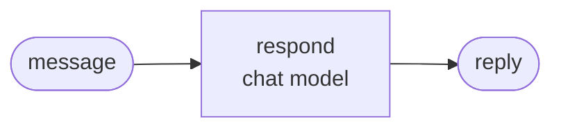

<div align="center">

# jyje/template-pilot-python


<!-- pilot:tagline -->🧪 ChatGPT 구독 또는 NVIDIA NIM으로 만드는 Python 파일럿용 GitHub 템플릿<!-- /pilot:tagline -->

[](https://github.com/jyje/template-pilot-python)
[](LICENSE)
[](https://www.python.org)
[](docs/02-providers.md)
[](https://build.nvidia.com)

[English](README.md) / [한국어](README-ko.md) / [日本語](README-ja.md) / [简体中文](README-zh-CN.md) / [Docs](docs/README.md)

---

**이 저장소가 도움이 됐다면 ⭐ 별을 달아주세요. 다른 분들이 찾는 데 도움이 됩니다.**

</div>

<!-- template:begin -->
## 이 템플릿 사용하기

이 템플릿으로 저장소를 만들고, 파일럿 이름으로 바꾼 뒤 레시피를 따르세요.

```bash
gh repo create jyje/pilot-<topic> --template jyje/template-pilot-python --public --clone
cd pilot-<topic>
python3 scripts/init_pilot.py pilot-<topic> --description "what it studies"
```

### 포함된 것

- **uv 앱**: Python 3.13, `src/`에 ruff, ty, pytest가 설정되어 있습니다.
- **채팅 모델 팩토리 하나**와 공급자 두 개: (1) Codex OAuth를 쓰는 ChatGPT 구독, (2) NVIDIA NIM. 케이스는 공급자를 언급하지 않습니다.
- **예시 그래프, `doctor.py`, 노트북, 오프라인 테스트, CI**가 처음부터 통과합니다.
- 에이전트용 **스킬**(`.agents`는 `.claude`로 연결): `pilot-workflow`, `python-lint`, `git-commit-helper`, `centered-readme`.
- **`GOAL.md`와 `PLAN.md`**: 첫 프롬프트를 남기고, 항목 하나가 커밋 하나인 체크리스트로 계획합니다.
- **Mermaid 문서**, 릴리스 워크플로(태그에서 git-cliff로 GitHub Release), gitmoji를 이해하는 dependabot, Copilot 설정 단계.

그다음 [GOAL.md](GOAL.md)와 [PLAN.md](PLAN.md)를 채우고 [레시피](docs/03-recipe-ko.md)를 따르세요.

<!-- template:end -->
## 이 파일럿의 목표

*가안입니다. 이 섹션을 파일럿의 실제 목표로 바꾸세요.*

**[제품]**을 **[프레임워크]**에 실제로 적용해 보고, 무엇이 되고 무엇이 안 되는지 기록합니다.

1. **[제품] 이해하기.** [한 줄]. [개요](docs/01-getting-started-ko.md)를 참고하세요.
2. **역할 분담 보여주기.** [한 줄].
3. **[Case 01 목표].** [한 줄].
4. **[Case 02 목표].** [한 줄].
5. **검증하기.** 단위 테스트, 실서비스 스크립트, 실행된 노트북으로 확인하고 측정 결과, 실패 사례, 주의점을 공개합니다.

이 파일럿이 아닌 것:

- [제품]의 정확도를 재는 벤치마크가 아닙니다.
- 운영용 코드가 아닙니다.

## 케이스

결과는 `src/notebooks/`의 실행된 노트북에서 가져왔으며, 각 실험을 여러 번 반복해 경향이 보이게 합니다.

### Case 01: [이름]



각 메시지를 그래프에 **10번**씩 통과시켰습니다:

| 메시지 | 경로 | 신뢰도 |
| --- | --- | --- |
| [입력 1] | `<경로>` 10/10 | 0.99 |
| [입력 2] | `<경로>` 10/10 | 0.85 |

표 읽는 법:

- **경로**: 그래프가 메시지를 보낸 곳입니다. `10/10`은 10번 모두 그 경로를 골랐다는 뜻입니다.
- **신뢰도**: 모델이 자신의 답을 얼마나 강하게 선택했는지를 0~1로 나타냅니다. 얼마나 확신하는지를 보여줄 뿐, 맞았는지를 뜻하지는 않습니다.

## 빠른 시작

```bash
cp .env.sample .env        # add NVIDIA_API_KEY if you use NIM
cd src && uv sync

uv run python doctor.py                    # check your keys and the chat model
uv run python -m case01_hello.main         # the example graph
uv run pytest                              # offline tests, no keys needed
```

`uv run python doctor.py`가 키와 채팅 모델을 점검합니다. ChatGPT 공급자는 `uv run python -m pilot_kit.chatgpt_login`을 한 번 실행하세요.

## 문서

| 문서 | 다루는 내용 |
| --- | --- |
| [시작하기](docs/01-getting-started-ko.md) | 설정, 환경변수, 실행, 문제 해결 |
| [공급자](docs/02-providers-ko.md) | ChatGPT 구독과 NVIDIA NIM |
| [레시피](docs/03-recipe-ko.md) | 아이디어에서 `v0.1.0`까지 |

에이전트용 컨텍스트는 [AGENTS.md](AGENTS.md)를 참고하세요.

## 라이선스

[MIT](LICENSE)
