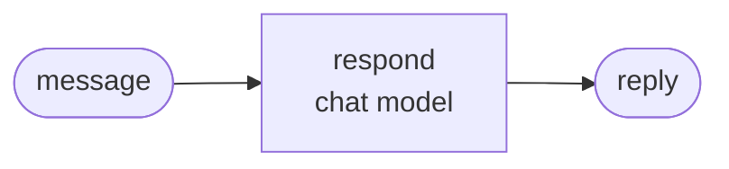

<div align="center">

# jyje/template-pilot-ai-python


<!-- pilot:tagline -->

🧪 基于 ChatGPT 订阅或 NVIDIA NIM 的 Python AI 试点 GitHub 模板

<!-- /pilot:tagline -->

[](https://github.com/jyje/template-pilot-ai-python)
[](LICENSE)
[](https://www.python.org)
[](docs/02-providers.md)
[](https://build.nvidia.com)

[English](README.md) / [한국어](README-ko.md) / [日本語](README-ja.md) / [简体中文](README-zh-CN.md) / [Docs](docs/README.md)

---

**觉得有用？请点个 ⭐，帮助更多人发现这个项目。**

</div>

<!-- template:begin -->
## 使用这个模板

用这个模板创建仓库，把它改名成试点，然后按配方推进。

```bash
gh repo create jyje/pilot-<topic> --template jyje/template-pilot-ai-python --public --clone
cd pilot-<topic>
python3 scripts/init_pilot.py pilot-<topic> --description "what it studies"
```

### 包含什么

- **uv 应用**：Python 3.13，`src/` 中已配置 ruff、ty 和 pytest。
- **一个聊天模型工厂**和两个提供方：（1）通过 Codex OAuth 使用 ChatGPT 订阅，（2）NVIDIA NIM。用例从不提及提供方。
- **示例图、`doctor.py`、notebook、离线测试和 CI**，开箱即通过。
- 面向智能体的**技能**（`.agents` 链接到 `.claude`）：`pilot-workflow`、`python-lint`、`git-commit-helper`、`centered-readme`。
- **`GOAL.md` 和 `PLAN.md`**：保留第一条提示词，再用“一项 = 一次提交”的清单来规划。
- **带 Mermaid 的文档**、发布工作流（打标签后用 git-cliff 生成 GitHub Release）、识别 gitmoji 的 dependabot，以及 Copilot 环境准备步骤。

然后填写 [GOAL.md](GOAL.md) 和 [PLAN.md](PLAN.md)，并按[配方](docs/03-recipe.md)推进。

<!-- template:end -->
## 本试点的目标

*草稿。请把本节替换为试点的真实目标。*

把 **[产品]** 真正接入 **[框架]**，并记录哪些行得通、哪些行不通。

1. **理解 [产品]。** [一句话]。参见[概览](docs/01-getting-started.md)。
2. **说明各自分工。** [一句话]。
3. **[Case 01 的目标]。** [一句话]。
4. **[Case 02 的目标]。** [一句话]。
5. **验证。** 用单元测试、实时脚本和已执行的 notebook 进行验证，并公开实测结果、失败情况与注意事项。

它不是：

- [产品] 准确率的基准测试。
- 生产级代码。

## 案例

结果来自 `src/notebooks/` 中已执行的 notebook，它们把每个实验重复多次，让趋势清晰可见。

### Case 01：[名称]



每条消息都经过图 **10 次**：

| 消息 | 路由 | 置信度 |
| --- | --- | --- |
| [输入 1] | `<路由>` 10/10 | 0.99 |
| [输入 2] | `<路由>` 10/10 | 0.85 |

表格怎么读：

- **路由**：图把这条消息送去了哪里。`10/10` 表示 10 次运行全都选了它。
- **置信度**：模型有多强烈地选择了自己的答案，范围 0 到 1。它表示有多确定，不代表判断一定正确。

## 快速开始

```bash
cp .env.sample .env        # add NVIDIA_API_KEY if you use NIM
cd src && uv sync

uv run python doctor.py                    # check your keys and the chat model
uv run python -m case01_hello.main         # the example graph
uv run pytest                              # offline tests, no keys needed
```

`uv run python doctor.py` 会检查密钥和聊天模型。使用 ChatGPT 提供方时，先运行一次 `uv run python -m pilot_kit.chatgpt_login`。

## 文档

| 文档 | 内容 |
| --- | --- |
| [开始使用](docs/01-getting-started.md) | 配置、环境变量、运行、故障排查 |
| [提供方](docs/02-providers.md) | ChatGPT 订阅与 NVIDIA NIM |
| [配方](docs/03-recipe.md) | 从想法到 `v0.1.0` |

智能体上下文：[AGENTS.md](AGENTS.md)。

## 许可证

[MIT](LICENSE)
