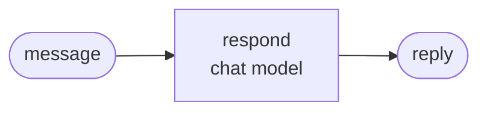

<div align="center">

# jyje/template-pilot-ai-python


<!-- pilot:tagline -->

🧪 GitHub template for AI pilots in Python on a ChatGPT subscription or NVIDIA NIM

<!-- /pilot:tagline -->

[](https://github.com/jyje/template-pilot-ai-python)
[](LICENSE)
[](https://www.python.org)
[](docs/02-providers.md)
[](https://build.nvidia.com)

[English](README.md) / [한국어](README-ko.md) / [日本語](README-ja.md) / [简体中文](README-zh-CN.md) / [Docs](docs/README.md)

---

**Found this useful? Please give it a ⭐. It helps others find it.**

</div>

<!-- template:begin -->
## Use this template

Create a repo from this template, rename it into a pilot, then follow the recipe.

```bash
gh repo create jyje/pilot-<topic> --template jyje/template-pilot-ai-python --public --clone
cd pilot-<topic>
python3 scripts/init_pilot.py pilot-<topic> --description "what it studies"
```

### What you get

- **A uv app** on Python 3.13 in `src/`, with ruff, ty, and pytest configured.
- **One chat model factory** with two providers: (1) a ChatGPT subscription through Codex OAuth and (2) NVIDIA NIM. Cases never mention a provider.
- **An example graph, `doctor.py`, a notebook, offline tests, and CI**, all passing out of the box.
- **Skills** for agents (`.agents` links to `.claude`): `pilot-workflow`, `python-lint`, `git-commit-helper`, `centered-readme`.
- **`GOAL.md` and `PLAN.md`**: keep the first prompt, then plan with a checklist where one item is one commit.
- **Docs with Mermaid**, a release workflow (tag to GitHub Release with git-cliff), gitmoji-aware dependabot, and Copilot setup steps.

Then fill in [GOAL.md](GOAL.md) and [PLAN.md](PLAN.md) and follow the [recipe](docs/03-recipe.md).

<!-- template:end -->
## A goal of this pilot

*Draft. Replace this section with the pilot's real goals.*

Put **[product]** into **[framework]** for real, and record what works and what does not.

1. **Understand [product].** [one line]. See the [overview](docs/01-getting-started.md).
2. **Show who does what.** [one line].
3. **[Case 01 goal].** [one line].
4. **[Case 02 goal].** [one line].
5. **Verify.** Unit tests, live scripts, and executed notebooks, with the measured results, failures, and caveats published.

What it is not:

- A benchmark of [product]'s accuracy.
- Production code.

## Cases

Results come from the executed notebooks in `src/notebooks/`, which repeat each experiment several times so that trends show.

### Case 01: [name]



Each message went through the graph **10 times**:

| Message | Route | Confidence |
| --- | --- | --- |
| [input 1] | `<route>` 10/10 | 0.99 |
| [input 2] | `<route>` 10/10 | 0.85 |

How to read the table:

- **Route**: where the graph sent the message. `10/10` means all 10 runs chose it.
- **Confidence**: how strongly the model favors its answer, from 0 to 1. It shows how decided it is, not whether it is right.

## Quick start

```bash
cp .env.sample .env        # add NVIDIA_API_KEY if you use NIM
cd src && uv sync

uv run python doctor.py                    # check your keys and the chat model
uv run python -m case01_hello.main         # the example graph
uv run pytest                              # offline tests, no keys needed
```

`uv run python doctor.py` checks your keys and the chat model. Use `uv run python -m pilot_kit.chatgpt_login` once for the ChatGPT provider.

## Docs

| Guide | What it covers |
| --- | --- |
| [Getting started](docs/01-getting-started.md) | setup, environment, run, troubleshooting |
| [Providers](docs/02-providers.md) | ChatGPT subscription and NVIDIA NIM |
| [Recipe](docs/03-recipe.md) | from an idea to `v0.1.0` |

Agent context: [AGENTS.md](AGENTS.md).

## License

[MIT](LICENSE)
