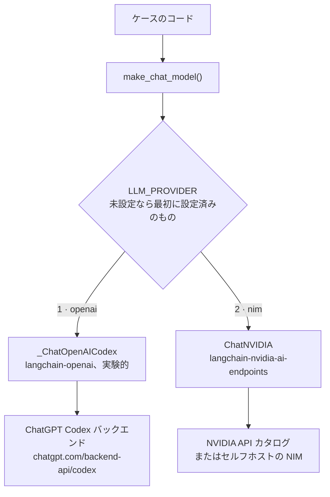
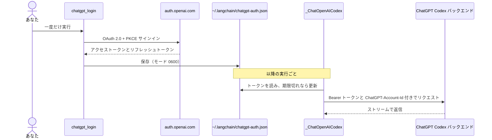

# プロバイダ

チャットモデルのプロバイダは優先順に 2 つです。ケースはプロバイダに一切触れず、
`pilot_kit.llm.make_chat_model()` を呼びます。この関数が `LLM_PROVIDER` を読みます。

| # | `LLM_PROVIDER` | バックエンド | 認証 |
| --- | --- | --- | --- |
| 1 | `openai` | Codex バックエンド経由の ChatGPT サブスクリプション | ChatGPT OAuth サインイン、API キー不要 |
| 2 | `nim` | NVIDIA NIM | `NVIDIA_API_KEY` |



`LLM_PROVIDER` が未設定なら、最初に設定済みのプロバイダが選ばれます。ChatGPT にサインイン済みなら
`openai`、そうでなければ `nim` です。自動選択では ChatGPT プランの利用上限に達したことを判断できないため、
達した場合は自分で `LLM_PROVIDER` を指定してください。

## 1. ChatGPT サブスクリプション（Codex OAuth）

OpenAI の API キーの代わりに ChatGPT サブスクリプションを使います。公開の `api.openai.com` API では
**ありません**。`langchain-openai` に含まれる実験的な `_ChatOpenAICodex` が ChatGPT OAuth（PKCE）で
サインインし、ChatGPT Codex バックエンドを呼び出します。OAuth トークンを `ChatOpenAI` に渡しても
動作しません。

```bash
uv run python -m pilot_kit.chatgpt_login    # ブラウザを開き、最大 15 分待つ
uv run python -m pilot_kit.chatgpt_models   # アカウントで使えるモデル ID を一覧表示。トークンは表示しない
```



- **実験的で非公式です。** クラスは非公開で、変更される可能性があります。ご自身の OpenAI アカウント、
  プラン、および適用される OpenAI の規約が ChatGPT 認証による Codex アクセスを許す範囲でのみ使ってください。
  共有環境や本番では、API キー、Azure OpenAI、または社内ゲートウェイを優先します。
- トークンは `~/.codex/auth.json` ではなく `~/.langchain/chatgpt-auth.json` に保存されます。別のプログラムから
  Codex CLI のトークンを更新すると Codex CLI のセッションが壊れることがあるため、そのファイルには
  絶対に触れないでください。
- サインインは `http://localhost:1455` で待ち受けるため、同じマシンのブラウザが必要です。
  デバイスコードフロー（`--device`）は `langchain-openai` 1.6.2 で HTTP 400 になりました。
- **モデル名はアカウントごとに異なります。** 一覧にある名前でも、ChatGPT アカウントでは拒否されたり
  （HTTP 400）、利用上限に達していたり（HTTP 429）することがあります。既定の `gpt-5.5` は
  `langchain-openai` のドキュメントに由来します。
- バックエンドはストリームのみです。`invoke` は 1 つにまとめたメッセージを返します。呼び出しは
  ChatGPT プランの上限に数えられます。

## 2. NVIDIA NIM

パッケージは `langchain-nvidia-ai-endpoints`、クラスは `ChatNVIDIA` です。`langchain-nvidia-nim` という
パッケージはありません。

```dotenv
LLM_PROVIDER=nim
NVIDIA_API_KEY=nvapi-...
# LLM_MODEL=nvidia/nemotron-3.5-lightning-30b-a3b   (default)
# NVIDIA_BASE_URL=http://0.0.0.0:8000/v1            (self-hosted NIM)
```

- **レイテンシは大きく、ばらつきます。** ホスト版の 1 回の呼び出しに約 6〜160 秒かかったため、
  `LLM_TIMEOUT` の既定は 180 秒です。クライアント既定の 60 秒では失敗します。
- **カタログに載っていても動くとは限りません。** 一覧のいくつかのモデルは、サポート終了のため
  `410 Gone` を返しました。使う前に一度呼び出してください。
- **推論モデル**は思考過程を返信に含めることがあります。`LLM_ENABLE_THINKING=false` は
  `chat_template_kwargs.enable_thinking: false` を送ります。
- **接続がリセットされることがあります。** `ChatNVIDIA` にはリトライ設定がないため、
  `pilot_kit.retry.with_retries` が接続エラー、タイムアウト、HTTP 429 と 5xx でチャットモデルの
  呼び出しを再試行します（401、403、404 は再試行しません）。対象はその呼び出しだけで、グラフ全体の
  実行は決して包みません。再実行すると他のサービスを再び呼んでしまうためです。

### NVIDIA キーを macOS キーチェーンに保存する

```bash
security add-generic-password -a <project> -s "NVIDIA API Key" -w    # 値の入力を求められる
NVIDIA_API_KEY="$(security find-generic-password -s 'NVIDIA API Key' -a <project> -w)" \
  uv run python doctor.py
```

プロジェクトごとに新しい項目を追加してください。他のプロジェクトの項目を上書きしないでください。

## リトライ

`pilot_kit.retry.with_retries` が、両方のプロバイダに対する唯一のリトライの担い手です。論理的なモデル呼び出し
1 回につき、最大 3 回試します（最初の呼び出しと再試行 2 回）。ChatGPT プロバイダは `max_retries=0` で作られ、
`ChatNVIDIA` にはリトライ設定がないため、ベンダー SDK が独自の試行を上乗せすることはありません。ベンダー側の
リトライを再び有効にすると、2 つの層が掛け算になります。

- **再試行の対象:** 接続エラー、タイムアウト、NIM の HTTP 429、500、502、503、504。OpenAI のエラーには、以前の SDK の
  方針をそのまま使います。HTTP 408、409、429 とすべての 5xx で、`x-should-retry` ヘッダがあればそれが優先されます。ステータスがなく、サーバーが過負荷だと伝えるストリームのエラーイベントも再試行します。
  400、401、403、404 は再試行しません。プランやクォータを使い切ったことを示す 429（`usage_limit_reached`、
  `insufficient_quota`）も、待っても直らないので再試行しません。
- **待ち時間:** ジッタ付きの指数バックオフ（ジッタ前で 5 秒、10 秒）で、上限は 60 秒です。エラーに `Retry-After`
  ヘッダ（秒または HTTP 日付）があれば、その値が待ち時間になり、こちらにも上限があります。
- **観測方法:** 再試行のたびに、任意の `on_retry(attempt, error)` コールバックと `pilot_kit.retry` ロガーに、
  エラーの種類と HTTP ステータスが記録されます。エラーメッセージは記録しません。

## 3 つ目のプロバイダを追加する

たとえば LM Studio のようなローカルの OpenAI 互換サーバーです。`PROVIDERS` に名前を、`DEFAULT_MODELS` に
既定のモデルを追加し、`make_chat_model` に分岐（`ChatOpenAI(base_url=...,
api_key="lm-studio")`）を足します。あわせて `tests/test_llm.py` にあるような recorder スタブでテストを
書きます。エージェントフレームワークで使うには、LM Studio のコンテキスト長が 16k 以上必要です。
