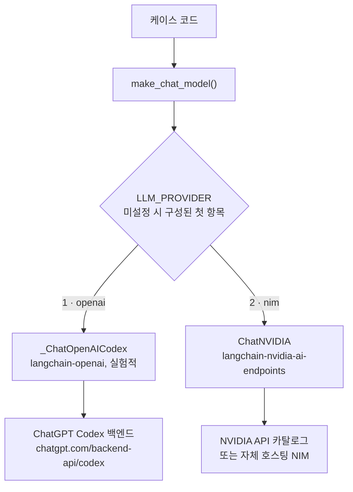
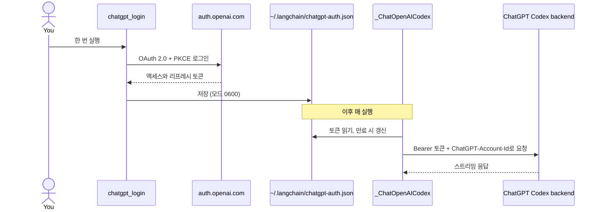

# 공급자

채팅 모델 공급자는 우선순위 순으로 두 가지입니다. 케이스는 공급자를 전혀 언급하지 않고
`pilot_kit.llm.make_chat_model()`을 호출하며, 이 함수가 `LLM_PROVIDER`를 읽습니다.

| # | `LLM_PROVIDER` | 백엔드 | 인증 |
| --- | --- | --- | --- |
| 1 | `openai` | Codex 백엔드를 통한 ChatGPT 구독 | ChatGPT OAuth 로그인, API 키 없음 |
| 2 | `nim` | NVIDIA NIM | `NVIDIA_API_KEY` |



`LLM_PROVIDER`를 설정하지 않으면 구성된 첫 공급자가 선택됩니다. ChatGPT에 로그인했다면 `openai`,
아니면 `nim`입니다. 자동 선택은 ChatGPT 요금제의 사용량 한도가 소진되었는지 알 수 없으므로, 소진되었다면
`LLM_PROVIDER`를 직접 지정하세요.

## 1. ChatGPT 구독 (Codex OAuth)

OpenAI API 키 대신 ChatGPT 구독을 씁니다. 공개 `api.openai.com` API가 **아닙니다**. `langchain-openai`에
들어 있는 실험적 `_ChatOpenAICodex`가 ChatGPT OAuth(PKCE)로 로그인해 ChatGPT Codex 백엔드를 호출합니다.
OAuth 토큰을 `ChatOpenAI`에 넘기는 방식은 동작하지 않습니다.

```bash
uv run python -m pilot_kit.chatgpt_login    # 브라우저를 열고 최대 15분 기다립니다
uv run python -m pilot_kit.chatgpt_models   # 계정이 쓸 수 있는 모델 ID를 출력, 토큰은 절대 출력하지 않음
```



- **실험적이고 비공식입니다.** 클래스가 비공개라 바뀔 수 있습니다. OpenAI 계정, 요금제, 관련 약관이
  ChatGPT 인증 Codex 접근을 허용하는 곳에서만 쓰세요. 공유나 운영 환경에는 API 키, Azure OpenAI, 사내
  게이트웨이를 권장합니다.
- 토큰은 `~/.codex/auth.json`이 **아니라** `~/.langchain/chatgpt-auth.json`에 있습니다. 다른 프로그램이
  Codex CLI 토큰을 갱신하면 Codex CLI 세션이 깨질 수 있으므로 그 파일은 절대 건드리지 마세요.
- 로그인은 콜백을 받으려고 `http://localhost:1455`에서 대기하므로 같은 컴퓨터의 브라우저가 필요합니다.
  기기 코드 방식(`--device`)은 `langchain-openai` 1.6.2에서 HTTP 400으로 실패했습니다.
- **모델 이름은 계정마다 다릅니다.** 목록에 있는 이름도 ChatGPT 계정에서 거절되거나(HTTP 400) 사용량 한도를
  넘을 수 있습니다(HTTP 429). 기본값 `gpt-5.5`는 `langchain-openai` 문서에서 가져왔습니다.
- 백엔드는 스트리밍만 지원하며 `invoke`는 여전히 집계된 메시지 하나를 돌려줍니다. 호출은 ChatGPT 요금제
  한도에 포함됩니다.

## 2. NVIDIA NIM

패키지는 `langchain-nvidia-ai-endpoints`, 클래스는 `ChatNVIDIA`입니다. `langchain-nvidia-nim`이라는 패키지는
없습니다.

```dotenv
LLM_PROVIDER=nim
NVIDIA_API_KEY=nvapi-...
# LLM_MODEL=nvidia/nemotron-3.5-lightning-30b-a3b   (기본값)
# NVIDIA_BASE_URL=http://0.0.0.0:8000/v1            (자체 호스팅 NIM)
```

- **지연이 크고 들쭉날쭉합니다.** 호스티드 호출 한 번에 대략 6~160초가 걸려서 `LLM_TIMEOUT` 기본값이 180초입니다.
  클라이언트 기본 60초는 실패합니다.
- **카탈로그 목록이 동작을 보장하지 않습니다.** 목록에 있는 여러 모델이 수명 종료로 `410 Gone`을 돌려줬습니다.
  쓰기 전에 직접 호출해 보세요.
- **추론 모델**은 사고 과정을 응답에 섞을 수 있습니다. `LLM_ENABLE_THINKING=false`는
  `chat_template_kwargs.enable_thinking: false`를 보냅니다.
- **연결이 끊길 수 있습니다.** `ChatNVIDIA`에는 재시도 설정이 없어서 `pilot_kit.retry.with_retries`가 연결 오류,
  타임아웃, HTTP 429 또는 5xx에 대해 채팅 모델 호출을 재시도합니다(401, 403, 404는 재시도하지 않음). 그
  호출만 감싸며 그래프 전체 실행은 감싸지 않습니다. 다시 실행하면 다른 서비스를 또 호출하기 때문입니다.

### NVIDIA 키를 macOS 키체인에 보관

```bash
security add-generic-password -a <project> -s "NVIDIA API Key" -w    # 값을 프롬프트로 입력
NVIDIA_API_KEY="$(security find-generic-password -s 'NVIDIA API Key' -a <project> -w)" \
  uv run python doctor.py
```

프로젝트마다 새 항목을 추가하세요. 다른 프로젝트의 항목을 덮어쓰지 마세요.

## 세 번째 공급자 추가

예를 들어 LM Studio 같은 로컬 OpenAI 호환 서버라면, `PROVIDERS`에 이름을, `DEFAULT_MODELS`에 기본 모델을
추가하고 `make_chat_model`에 분기(`ChatOpenAI(base_url=..., api_key="lm-studio")`)를 넣은 뒤,
`tests/test_llm.py`처럼 기록용 스텁으로 테스트를 추가합니다. 에이전트 프레임워크에서 LM Studio는 컨텍스트
길이가 최소 16k 필요합니다.
