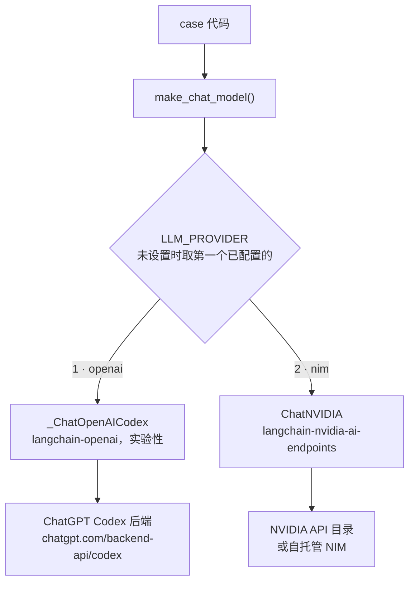
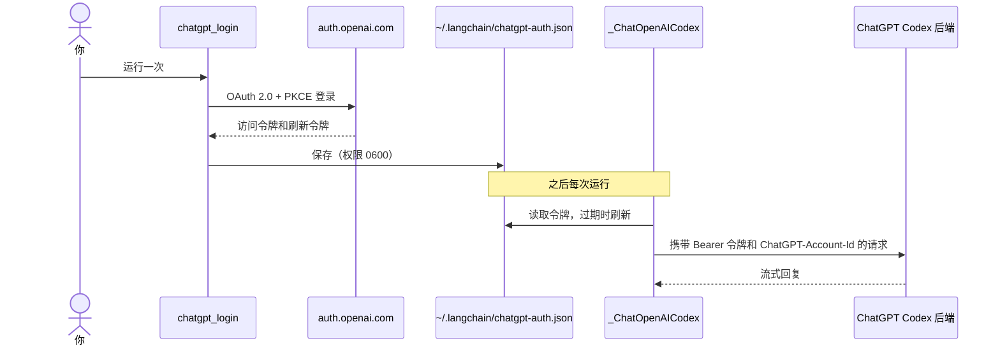

# 提供方

聊天模型提供方有两个，按优先级排列。各个 case 从不提及具体提供方，只调用
`pilot_kit.llm.make_chat_model()`，由它读取 `LLM_PROVIDER`。

| # | `LLM_PROVIDER` | 后端 | 认证 |
| --- | --- | --- | --- |
| 1 | `openai` | 通过 Codex 后端使用 ChatGPT 订阅 | ChatGPT OAuth 登录，无需 API 密钥 |
| 2 | `nim` | NVIDIA NIM | `NVIDIA_API_KEY` |



未设置 `LLM_PROVIDER` 时，第一个已配置的提供方生效：如果你已登录 ChatGPT 就用 `openai`，否则用
`nim`。自动模式无法得知你的 ChatGPT 套餐是否已达到用量上限，所以达到后请自行设置 `LLM_PROVIDER`。

## 1. ChatGPT 订阅（Codex OAuth）

使用你的 ChatGPT 订阅，而不是 OpenAI API 密钥。它**不是**公开的 `api.openai.com` API：
`langchain-openai` 自带一个实验性的 `_ChatOpenAICodex`，通过 ChatGPT OAuth（PKCE）登录并调用
ChatGPT Codex 后端。把 OAuth 令牌传给 `ChatOpenAI` 是行不通的。

```bash
uv run python -m pilot_kit.chatgpt_login    # 打开浏览器，最多等待 15 分钟
uv run python -m pilot_kit.chatgpt_models   # 列出你的账号可用的模型 ID，绝不显示令牌
```



- **实验性且非官方。** 这些类是私有的，可能会变化。只有在你的 OpenAI 账号、套餐以及适用的 OpenAI 条款
  允许通过 ChatGPT 认证访问 Codex 时才使用。共享或生产环境请优先使用 API 密钥、Azure OpenAI 或内部网关。
- 令牌保存在 `~/.langchain/chatgpt-auth.json`，**不是** `~/.codex/auth.json`。从其他程序刷新 Codex CLI 的令牌
  可能会破坏 Codex CLI 的会话，所以绝不要碰那个文件。
- 登录会监听 `http://localhost:1455`，因此需要同一台机器上的浏览器。设备码流程（`--device`）在
  `langchain-openai` 1.6.2 中失败并返回 HTTP 400。
- **模型名称因账号而异。** 列出的名称仍可能被 ChatGPT 账号拒绝（HTTP 400），或已超出用量上限
  （HTTP 429）。默认的 `gpt-5.5` 来自 `langchain-openai` 的文档。
- 该后端只支持流式。`invoke` 仍会返回一条聚合后的消息。调用会计入你的 ChatGPT 套餐额度。

## 2. NVIDIA NIM

包名是 `langchain-nvidia-ai-endpoints`，类是 `ChatNVIDIA`。不存在名为 `langchain-nvidia-nim` 的包。

```dotenv
LLM_PROVIDER=nim
NVIDIA_API_KEY=nvapi-...
# LLM_MODEL=nvidia/nemotron-3.5-lightning-30b-a3b   (default)
# NVIDIA_BASE_URL=http://0.0.0.0:8000/v1            (self-hosted NIM)
```

- **延迟高且不稳定。** 托管服务的单次调用大约耗时 6 到 160 秒，所以 `LLM_TIMEOUT` 默认为 180 秒。
  客户端默认的 60 秒会失败。
- **目录中列出不代表模型可用。** 列出的多个模型因已停止服务而返回 `410 Gone`。使用前先调用一次。
- **推理模型**可能把思考过程放进回复。`LLM_ENABLE_THINKING=false` 会发送
  `chat_template_kwargs.enable_thinking: false`。
- **连接可能被重置。** `ChatNVIDIA` 没有重试设置，所以 `pilot_kit.retry.with_retries` 会在连接错误、
  超时以及 HTTP 429 或 5xx 时重试聊天模型的调用（401、403、404 不重试）。它只包裹那一次调用，绝不包裹整个
  图的运行，因为重放会再次调用你的其他服务。

### 把 NVIDIA 密钥放进 macOS 钥匙串

```bash
security add-generic-password -a <project> -s "NVIDIA API Key" -w    # 提示输入值
NVIDIA_API_KEY="$(security find-generic-password -s 'NVIDIA API Key' -a <project> -w)" \
  uv run python doctor.py
```

为每个项目新增一个条目，不要覆盖其他项目的条目。

## 添加第三个提供方

例如 LM Studio 这样的本地 OpenAI 兼容服务器：把它的名称加入 `PROVIDERS`，把默认模型加入
`DEFAULT_MODELS`，在 `make_chat_model` 中增加一个分支（`ChatOpenAI(base_url=...,
api_key="lm-studio")`），并参照 `tests/test_llm.py` 中的 recorder 桩写一个测试。
LM Studio 供智能体框架使用时，上下文长度至少需要 16k。
