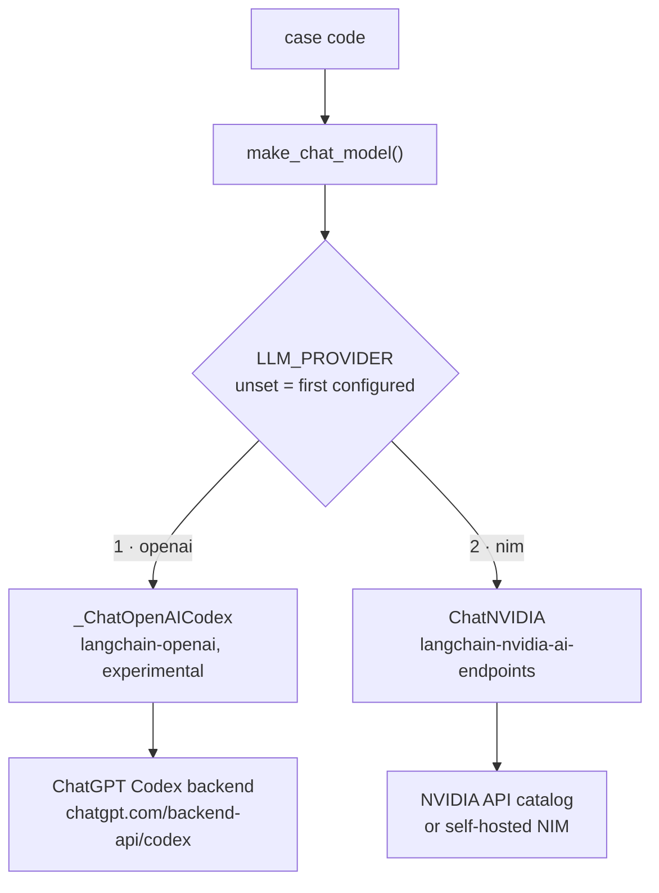
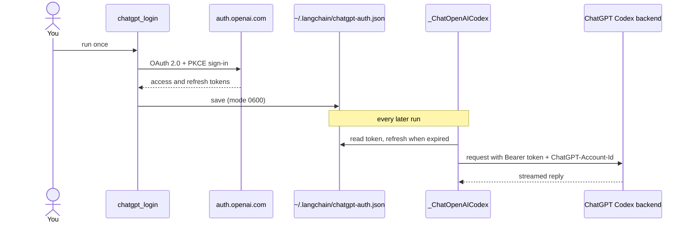

# Providers

Two chat model providers, in priority order. The cases never mention a provider: they call
`pilot_kit.llm.make_chat_model()`, which reads `LLM_PROVIDER`.

| # | `LLM_PROVIDER` | Backend | Auth |
| --- | --- | --- | --- |
| 1 | `openai` | ChatGPT subscription through the Codex backend | ChatGPT OAuth sign-in, no API key |
| 2 | `nim` | NVIDIA NIM | `NVIDIA_API_KEY` |



When `LLM_PROVIDER` is unset the first configured provider wins: `openai` if you have signed in to
ChatGPT, else `nim`. Auto mode cannot know that your ChatGPT plan has hit its usage limit, so set
`LLM_PROVIDER` yourself when it has.

## 1. ChatGPT subscription (Codex OAuth)

Uses your ChatGPT subscription instead of an OpenAI API key. It is **not** the public
`api.openai.com` API: `langchain-openai` ships an experimental `_ChatOpenAICodex` that signs in with
ChatGPT OAuth (PKCE) and calls the ChatGPT Codex backend. Passing an OAuth token to `ChatOpenAI` does
not work.

```bash
uv run python -m pilot_kit.chatgpt_login    # opens a browser and waits up to 15 minutes
uv run python -m pilot_kit.chatgpt_models   # lists model IDs your account offers, never the token
```



- **Experimental and unofficial.** The classes are private and may change. Use this only where your
  OpenAI account, plan, and the applicable OpenAI terms allow ChatGPT-authenticated Codex access. For
  shared or production use, prefer an API key, Azure OpenAI, or an internal gateway.
- The token lives in `~/.langchain/chatgpt-auth.json`, **not** in `~/.codex/auth.json`. Refreshing the
  Codex CLI token from another program can break Codex CLI sessions, so never touch that file.
- Sign-in listens on `http://localhost:1455`, so it needs a browser on the same machine. The
  device-code flow (`--device`) failed with HTTP 400 in `langchain-openai` 1.6.2.
- **Model names are account specific.** A listed name can still be rejected for ChatGPT accounts
  (HTTP 400) or be over its usage limit (HTTP 429). The default `gpt-5.5` comes from the
  `langchain-openai` docs.
- The backend only streams. `invoke` still returns one aggregated message. Calls count against your
  ChatGPT plan limits.

## 2. NVIDIA NIM

Package: `langchain-nvidia-ai-endpoints`, class `ChatNVIDIA`. There is no package called
`langchain-nvidia-nim`.

```dotenv
LLM_PROVIDER=nim
NVIDIA_API_KEY=nvapi-...
# LLM_MODEL=nvidia/nemotron-3.5-lightning-30b-a3b   (default)
# NVIDIA_BASE_URL=http://0.0.0.0:8000/v1            (self-hosted NIM)
```

- **Latency is high and uneven.** Single hosted calls took roughly 6 to 160 seconds, so `LLM_TIMEOUT`
  defaults to 180 seconds. The 60 second client default fails.
- **The catalog list is not proof a model works.** Several listed models returned `410 Gone` because
  they reached end of life. Call a model before relying on it.
- **Reasoning models** may put their thinking in the reply. `LLM_ENABLE_THINKING=false` sends
  `chat_template_kwargs.enable_thinking: false`.
- **Connections can reset.** `ChatNVIDIA` has no retry setting, so `pilot_kit.retry.with_retries`
  retries the chat model call on connection errors, timeouts, and HTTP 429 or 5xx (not on 401, 403,
  or 404). It wraps only that call, never a whole graph run, because a replay would call your other
  services again.

### Keep the NVIDIA key in the macOS keychain

```bash
security add-generic-password -a <project> -s "NVIDIA API Key" -w    # prompts for the value
NVIDIA_API_KEY="$(security find-generic-password -s 'NVIDIA API Key' -a <project> -w)" \
  uv run python doctor.py
```

Add a new item per project. Do not overwrite another project's item.

## Adding a third provider

For example a local OpenAI-compatible server such as LM Studio: add its name to `PROVIDERS`, its
default model to `DEFAULT_MODELS`, and a branch to `make_chat_model` (`ChatOpenAI(base_url=...,
api_key="lm-studio")`), plus a test with a recorder stub like the ones in `tests/test_llm.py`.
LM Studio needs a context length of at least 16k for agent frameworks.
