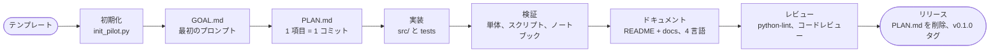

# アイデアから v0.1.0 まで

このテンプレートが組み込んでいる作業の流れです。`pilot-workflow` スキルはエージェント向けの短縮版です。



## 1. 初期化

`scripts/init_pilot.py` を実行し、`.env` を埋めて `doctor.py` を実行し、`🎉 init` でコミットします。

## 2. 目標と計画

最初のプロンプトを `GOAL.md` に貼り、要件の表をユーザーと一緒に埋めます。次に `PLAN.md` を編集します。
**チェックリストの 1 項目は、意味のある 1 つの作業であり、1 つのコミットです。** 項目の後ろにコミットタイトルを
書きます。項目にチェックを入れるのは、実行したあとだけです。すべてのチェックが付いたら、リリースの準備完了です。

## 3. 実装

- 共有コードは `src/pilot_kit/` に、ケースごとに 1 フォルダ（`case01_<name>/` に `graph.py` と
  `main.py`）、テストは `tests/` に置きます。
- ベンダーへのアクセスは、`ask` と `aask` を持つ `Protocol` で型付けした 1 つのゲートウェイクラスを通します。
  これでテストは、SDK の実際のレスポンス型を返すフェイクを差し込めます。

```python
class Gateway(Protocol):
    def ask(self, state, questions) -> Response: ...
    async def aask(self, state, questions) -> Response: ...
```

- グラフは遅延して構築し、モジュールを import するだけでは認証情報が要らないようにします。チャットモデルは
  イベントループの外（`asyncio.to_thread`）で構築します。
- ポリシー（しきい値やルーティング）は素のコードに置き、しきい値は未調整の出発点として扱います。

## 4. 3 段階で検証する

1. **単体:** フェイクを使ったオフラインの `pytest`。モデルを呼んではいけないルートには、触れると例外を
   投げるモデルを使います。
2. **スクリプト:** `doctor.py` と各ケースの `main.py` を、プロバイダごとに実サービスで実行します。遅い呼び出しは
   バックグラウンドで 1 つずつ実行します。ホスト版の NIM は同時実行の負荷で遅くなるためです。
3. **ノートブック:** 実行して出力を残します。単発の実行で止めず、各実験を繰り返します（安価なベンダー呼び出しは
   `asyncio.gather` で 10 回、遅いチャットモデルの実行は 3〜5 回）。期待結果付きの手書きシナリオスイープを
   加え、一致数と平均（最小〜最大）を Markdown の表（`IPython.display.Markdown`）で出力し、傾向が見えるように
   します。

検証していないことは、はっきり書きます。

## 5. ドキュメント

README は短く視覚的に: 目標、各ケースの図と結果、クイックスタート、リンク。詳細は `docs/` に置き、構造には
Mermaid のグラフ、流れにはシーケンス図を使います。公開前にすべてのブロックを描画して確認します:

```bash
npx -y -p @mermaid-js/mermaid-cli mmdc -i diagram.mmd -o diagram.svg
```

言語は常にこの順です: 英語、韓国語、日本語、簡体字中国語。結果の表の各列が何を意味するかは、表のすぐ下で説明します。

## 6. 品質

`python-lint` スキルに従います。次に、事前の文脈を持たない読み取り専用のサブエージェントにレビューを頼み、
各指摘をコードと照らして自分で読み、妥当なものを反映し、テストを加えます。これまでのパイロットで効果があった
指摘は、イベントループ内のブロッキング I/O、課金される呼び出しを再生したリトライ、しきい値比較をすり抜ける
NaN、ベンダーに届いた空の入力、デッドコードです。

## 7. リリース

1. `PLAN.md` のすべてのチェックが付き、リリースゲートが通っている。
2. `PLAN.md` を削除し、そのリンクも外して、`🚀 release: v0.1.0` でコミットします。
3. `git tag -a v0.1.0 -m v0.1.0` を実行し、コミットとタグをプッシュします。`release.yml` ワークフローが、前回のタグ
   以降のコミットから GitHub Release を作ります（`cliff.toml`）。
4. パイロットの索引を持っていれば（たとえば awesome-pilots の一覧）、そこにこのパイロットを追加します。
