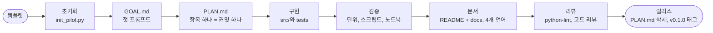

# 아이디어에서 v0.1.0까지

이 템플릿이 담고 있는 작업 흐름입니다. `pilot-workflow` 스킬은 에이전트용 요약본입니다.



## 1. 초기화

`scripts/init_pilot.py`를 실행하고 `.env`를 채운 뒤 `doctor.py`를 돌리고 `🎉 init`으로 커밋합니다.

## 2. 목표와 계획

첫 프롬프트를 `GOAL.md`에 붙여 넣고 요구사항 표를 사용자와 함께 채웁니다. 그다음 `PLAN.md`를 고칩니다.
**체크리스트 항목 하나는 의미 있는 작업 하나이자 커밋 하나**이며 항목 뒤에 커밋 제목을 적습니다. 실행해 본
뒤에만 체크합니다. 모든 칸이 체크되면 릴리스 준비가 끝난 것입니다.

## 3. 구현

- 공용 코드는 `src/pilot_kit/`, 케이스마다 폴더 하나(`case01_<name>/`에 `graph.py`와 `main.py`), 테스트는
  `tests/`에 둡니다.
- 벤더 호출은 `ask`와 `aask`를 가진 `Protocol` 타입 게이트웨이 클래스 하나를 거칩니다. 그래야 테스트가 SDK의
  실제 응답 타입을 돌려주는 가짜를 주입할 수 있습니다.

```python
class Gateway(Protocol):
    def ask(self, state, questions) -> Response: ...
    async def aask(self, state, questions) -> Response: ...
```

- 모듈을 import하는 데 자격 증명이 필요 없도록 그래프는 지연 생성하고, 채팅 모델은 이벤트 루프 밖에서
  (`asyncio.to_thread`) 만듭니다.
- 정책(임계값, 라우팅)은 일반 코드에 두고, 임계값은 튜닝하지 않은 출발점으로 취급합니다.

## 4. 3단계 검증

1. **단위:** 가짜를 쓴 오프라인 `pytest`. 모델을 부르면 안 되는 경로에는 건드리면 예외를 던지는 모델을 씁니다.
2. **스크립트:** `doctor.py`와 각 케이스의 `main.py`를 공급자마다 실서비스로 실행합니다. 호스티드 NIM은 동시
   부하에서 느려지므로 느린 호출은 백그라운드에서 하나씩 돌립니다.
3. **노트북:** 실행하고 출력을 보존합니다. 한 번 실행에서 멈추지 말고 실험을 반복하세요(싼 벤더 호출은
   `asyncio.gather`로 10번, 느린 채팅 모델 실행은 3~5번). 기대 결과가 있는 손으로 쓴 시나리오 스윕을 더하고,
   일치 횟수와 평균(최소~최대)을 담은 Markdown 표(`IPython.display.Markdown`)로 출력해 경향이 보이게 합니다.
   실제 실행은 `uv sync --extra notebook && cd notebooks && uv run jupyter nbconvert --to notebook --execute --inplace <name>.ipynb`로 합니다. 아직 시작용인 노트북은 `metadata.pilot.kind: example`로 표시하고, 실행을
   마치면 `result`로 바꿉니다. 그러면 CI가 모든 코드 셀이 실행되었고 출력이 남아 있는지 검사합니다. 자격 증명과 API 비용이
   필요하므로 수동 또는 릴리스 전 단계로 실행합니다.

검증하지 못한 것은 있는 그대로 적습니다.

## 5. 문서

README는 짧고 시각적으로: 목표, 다이어그램과 결과가 있는 각 케이스, 빠른 시작, 링크. 상세 내용은 `docs/`에
두고 구조는 Mermaid 그래프, 흐름은 시퀀스 다이어그램으로 보여 줍니다. 공개 전에 모든 블록을 렌더링해 봅니다.

```bash
npx -y -p @mermaid-js/mermaid-cli mmdc -i diagram.mmd -o diagram.svg
```

언어는 항상 이 순서입니다: 영어, 한국어, 일본어, 중국어 간체. 결과 표의 각 열이 무엇을 뜻하는지 표 바로 아래에
설명합니다.

## 6. 품질

`python-lint` 스킬을 따릅니다. 그다음 이전 컨텍스트가 없는 읽기 전용 서브에이전트에게 리뷰를 받고, 각 지적을
코드와 직접 대조해 타당한 것만 반영하고 테스트를 추가합니다. 이전 파일럿에서 효과가 컸던 지적은 이벤트 루프
안의 블로킹 I/O, 과금되는 호출을 다시 실행하는 재시도, 임계값 비교를 빠져나가는 NaN, 벤더로 넘어가는 빈 입력,
불필요한 코드입니다.

## 7. 릴리스

1. `PLAN.md`의 모든 칸이 체크되고 릴리스 게이트가 통과합니다.
2. `PLAN.md`를 삭제하고 링크를 지운 뒤 `🚀 release: v0.1.0`으로 커밋합니다.
3. `git tag -a v0.1.0 -m v0.1.0`으로 태그를 달고 커밋과 태그를 푸시합니다. `release.yml` 워크플로가 이전 태그
   이후의 커밋(`cliff.toml`)으로 GitHub Release를 만듭니다.
4. 완성된 파일럿을 파일럿 색인(예: awesome-pilots 목록)이 있다면 거기에 추가합니다.
