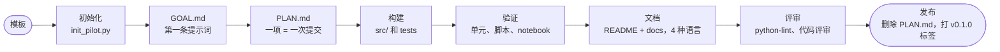

# 从想法到 v0.1.0

这个模板所固化的工作流程。`pilot-workflow` 技能是给智能体用的简短版本。



## 1. 初始化

运行 `scripts/init_pilot.py`，填写 `.env`，运行 `doctor.py`，以 `🎉 init` 提交。

## 2. 目标与计划

把第一条提示词粘贴到 `GOAL.md`，并与用户一起填写需求表。然后编辑 `PLAN.md`。
**一个清单项就是一项有意义的工作，也是一次提交**，项后写上提交标题。只有在它实际运行过之后才勾选。
所有复选框都勾选后，就可以发布了。

## 3. 构建

- 共享代码放在 `src/pilot_kit/`，每个 case 一个文件夹（`case01_<name>/`，含 `graph.py` 和
  `main.py`），测试放在 `tests/`。
- 通过一个网关类访问供应商，并用带有 `ask` 和 `aask` 的 `Protocol` 标注类型，这样测试可以注入一个
  返回 SDK 真实响应类型的假对象：

```python
class Gateway(Protocol):
    def ask(self, state, questions) -> Response: ...
    async def aask(self, state, questions) -> Response: ...
```

- 图要延迟构建，使导入模块不需要凭据；聊天模型要在事件循环之外构建（`asyncio.to_thread`）。
- 策略（阈值、路由）放在普通代码中，阈值只是未经调优的起点。

## 4. 三层验证

1. **单元：** 使用假对象的离线 `pytest`。不该调用模型的路由，使用一个被触碰就抛异常的模型。
2. **脚本：** `doctor.py` 和每个 case 的 `main.py`，在每个提供方上实际运行。慢调用放到后台，一次一个，
   因为托管的 NIM 在并发负载下会变慢。
3. **Notebook：** 执行并保留输出。不要止步于单次运行：重复每个实验（廉价的供应商调用用 `asyncio.gather`
   跑 10 次，慢的聊天模型运行跑 3 到 5 次），再加上一组带预期结果的手写场景扫描，并用 Markdown 表格
   （`IPython.display.Markdown`）输出一致次数和均值（最小到最大），让趋势显现出来。
   实际运行用 `uv sync --extra notebook && cd notebooks && uv run jupyter nbconvert --to notebook --execute --inplace <name>.ipynb`。仍是起步示例的 notebook 在 `metadata.pilot.kind` 中标为 `example`，运行完成后改为
   `result`，此后 CI 会要求每个代码单元都已执行并保留输出。它需要凭据并产生 API 费用，所以作为手动或发布前的步骤。

对没有验证的部分要如实说明。

## 5. 文档

README 简短且直观：目标、每个 case 的图和结果、快速开始、链接。细节放在 `docs/` 中，结构用 Mermaid 图，
流程用时序图。发布前渲染每一个代码块：

```bash
npx -y -p @mermaid-js/mermaid-cli mmdc -i diagram.mmd -o diagram.svg
```

语言顺序始终是：英语、韩语、日语、简体中文。结果表每一列的含义，要在表格下方立刻解释。

## 6. 质量

遵循 `python-lint` 技能。然后请一个没有任何先前上下文的只读子智能体做评审，自己对照代码阅读每条意见，
采纳有效的并为它们补充测试。以往的试点中很有价值的发现包括：事件循环中的阻塞 I/O、重放了计费调用的重试、
绕过阈值比较的 NaN、传到供应商的空输入，以及无用代码。

## 7. 发布

1. `PLAN.md` 的每个复选框都已勾选，发布门禁为绿色。
2. 删除 `PLAN.md`，移除指向它的链接，以 `🚀 release: v0.1.0` 提交。
3. 执行 `git tag -a v0.1.0 -m v0.1.0`，推送提交和标签。`release.yml` 工作流会根据自上一个标签以来的提交
   创建 GitHub Release（`cliff.toml`）。
4. 如果你维护试点索引（例如 awesome-pilots 列表），就把这个试点加进去。
