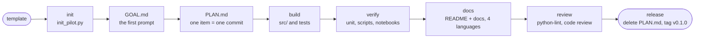

# From an idea to v0.1.0

The workflow this template encodes. The `pilot-workflow` skill is the short version for agents.



## 1. Init

Run `scripts/init_pilot.py`, fill `.env`, run `doctor.py`, commit `🎉 init`.

## 2. Goal and plan

Paste the first prompt into `GOAL.md` and fill the requirements table with the user. Then edit
`PLAN.md`. **One checklist item is one meaningful piece of work and one commit**, with the commit
title after it. Tick an item only after it ran. When every box is ticked, the release is ready.

## 3. Build

- Shared code in `src/pilot_kit/`, one folder per case (`case01_<name>/` with `graph.py` and
  `main.py`), tests in `tests/`.
- Reach the vendor through one gateway class typed as a `Protocol` with `ask` and `aask`, so tests
  inject a fake that returns the SDK's real response type:

```python
class Gateway(Protocol):
    def ask(self, state, questions) -> Response: ...
    async def aask(self, state, questions) -> Response: ...
```

- Build graphs lazily so importing a module needs no credentials, and build the chat model off the
  event loop (`asyncio.to_thread`).
- Keep policy (thresholds, routing) in plain code and treat thresholds as untuned starting points.

## 4. Verify in three tiers

1. **Unit:** `pytest` offline with fakes. Routes that must not call the model use a model that raises
   when touched.
2. **Scripts:** `doctor.py` and each case's `main.py`, live, on each provider. Run slow calls in the
   background, one at a time, because hosted NIM slows under concurrent load.
3. **Notebooks:** executed, outputs kept. Do not stop at single runs: repeat each experiment (10 runs
   for cheap vendor calls with `asyncio.gather`, 3 to 5 for slow chat-model runs), add a hand-written
   scenario sweep with expected outcomes, and print Markdown tables (`IPython.display.Markdown`) with
   agreement counts and mean (min to max), so trends show.
   Run them live with `uv sync --extra notebook && cd notebooks && uv run jupyter nbconvert --to notebook --execute --inplace <name>.ipynb`. A notebook that is still a starter says `metadata.pilot.kind: example`;
   once it is executed, set it to `result`, and CI then requires every code cell to have run and kept
   its output. This is a manual or pre-release step, since it needs credentials and costs API calls.

Say plainly what was not verified.

## 5. Docs

README short and visual: the goal, each case with its diagram and results, quick start, links. Detail
in `docs/`, with Mermaid graphs for structure and sequence diagrams for flows. Render every block
before publishing:

```bash
npx -y -p @mermaid-js/mermaid-cli mmdc -i diagram.mmd -o diagram.svg
```

Languages, always in this order: English, Korean, Japanese, Simplified Chinese. Explain what each
column of a results table means, right under the table.

## 6. Quality

Follow the `python-lint` skill. Then get a review from a read-only subagent with no prior context,
read each finding against the code yourself, apply the valid ones, and add tests for them. Findings
that paid off in earlier pilots: blocking I/O inside the event loop, a retry that replayed billed
calls, NaN slipping through threshold comparisons, empty input reaching the vendor, and dead code.

## 7. Release

1. Every `PLAN.md` box ticked and the release gate green.
2. Delete `PLAN.md`, remove its links, commit `🚀 release: v0.1.0`.
3. `git tag -a v0.1.0 -m v0.1.0`, push the commit and the tag. The `release.yml` workflow creates the
   GitHub Release from the commits since the previous tag (`cliff.toml`).
4. Add the pilot to your pilot index, if you keep one (for example an awesome-pilots list).
